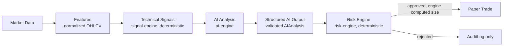

# MarketPilot AI — AI Architecture

This is the most safety-sensitive document in the Phase 1 set. The single rule it exists to enforce: **the AI analyzes; it never executes, and it never sets the numbers the risk engine actually uses to size a trade.**

## 1. Pipeline



`ai-engine` is a single package with one external dependency: an `AIProvider` interface (`packages/ai_engine/provider.py`), implemented today by a Claude client (`claude-sonnet-5` by default, model configurable via environment) and swappable for another provider without touching any caller — see [ADR-006](decisions/ADR-006-ai-risk-engine-separation.md).

## 2. Structured AI output schema

The LLM is asked to produce structured output (via Claude's tool-use / structured-output mechanism, not free-form text parsed with regex). The response is validated against this Pydantic schema before it is allowed to become an `AIAnalysis` row; a response that fails validation is discarded, logged, and produces no `AIAnalysis` — see [data-flow.md](data-flow.md) §3.

```python
class AIAnalysisOutput(BaseModel):
    symbol: str

    market_state: Literal[
        "BULLISH", "BEARISH", "NEUTRAL",
        "HIGH_RISK", "MARKET_CLOSED", "VOLATILITY_EVENT",
    ]
    trend: Literal["bullish", "bearish", "sideways"]
    momentum: Literal["strong", "moderate", "weak"]
    volume_assessment: Literal["above_average", "average", "below_average"]

    supporting_indicators: list[str]      # indicator names/ids the model cites
    conflicting_indicators: list[str]

    thesis: str                            # hedged natural-language rationale
    invalidation_conditions: str           # what would prove the thesis wrong

    risk_level: Literal["low", "moderate", "high"]
    confidence: Decimal                    # 0-100, model's stated certainty

    suggested_action: Literal["long", "short", "hold", "close", "none"]
    entry_zone_low: Decimal | None
    entry_zone_high: Decimal | None
    stop_loss: Decimal | None
    take_profit_low: Decimal | None
    take_profit_high: Decimal | None

    generated_at: datetime
```

`market_state` is the same six-value enumeration used by the [`MarketStateVisualization`](ui-design-system.md) component — one vocabulary from model output to pixel, so the signature gauge never has to translate or guess.

## 3. Context assembly

`ai-engine` builds the prompt from data it already has in Postgres — it never queries the AI provider for facts, only for interpretation:

- The triggering `Signal` (direction, strength, which indicators fired).
- The relevant `Indicators` (values, not raw price history — keeps the prompt small and the model's job narrow: interpret, don't recompute).
- A portfolio *summary* only when analysis is portfolio-contextual (exposure %, open position count) — never account credentials, never other users' data, never anything from `risk_rules` (see §4).
- The prompt template version is recorded on the output (`prompt_version`), so a historical `AIAnalysis` remains attributable to the exact prompt that produced it even after the template changes.

System-prompt instructions require hedged, non-certain language ("conditions currently favor...", "confidence reflects model certainty, not probability of profit") and forbid presenting the analysis as guaranteed advice — enforced by instruction and by the UI layer (see [ui-design-system.md](ui-design-system.md)), not by the schema, since `thesis` is free text. The schema is what makes the *decision-relevant* fields safe; the *prose* is made safe by instruction, review, and UI framing.

## 4. Why the AI cannot bypass the risk engine

This is the architectural boundary, stated precisely:

1. **The AI never writes to `risk_rules`, `portfolios.cash`, `positions`, or `orders`.** `ai-engine`'s only write is `ai_analyses`. No code path exists from `ai-engine` to any other table.
2. **`risk-engine.evaluate()` does not take the AI's numbers as trade parameters.** When an `AIAnalysis.suggested_action` implies a trade, the risk engine reads the *action direction* (long/short/close) from it but computes position size, stop-loss, and take-profit itself, from `risk_rules` (`max_position_size_pct`, `default_stop_loss_pct`, `default_take_profit_pct`) and current portfolio state — never from `AIAnalysis.entry_zone_*`, `.stop_loss`, or `.take_profit_*`. Those fields exist for the human reading the AI Analyst screen, not as inputs to the order the system might place. A prompt-injected or hallucinated "position size: 500% of portfolio" in the AI's output has no code path to affect an actual order, because nothing downstream reads a size from the AI's response at all.
3. **Every order carries `risk_decision` and `risk_decision_reason`.** An order's approval is always traceable to specific `risk_rules` values and portfolio state at evaluation time, in the audit log — never to "the AI approved it," because the AI has no approval authority.
4. **A malformed or adversarial AI response is inert.** Because the response is schema-validated before it becomes an `AIAnalysis`, and the risk engine only reacts to validated `AIAnalysis` rows via their `suggested_action` enum (five fixed values), there is no field an attacker-controlled model response could populate that reaches executable logic — the worst case of a compromised or manipulated LLM response is a bad `AIAnalysis` row with a wrong or missing signal, not a trade.

## 5. Failure modes (cross-reference)

Provider timeout, provider error, and schema-validation failure are all fail-closed — no `AIAnalysis`, no downstream action. Full behavior: [architecture.md](architecture.md) §7 and [data-flow.md](data-flow.md) §3.

## 6. Mock/labeled data

In the MVP, `market-data` is sourced from `MockMarketDataProvider` (see [architecture.md](architecture.md) §3), and `market_data.source = 'mock'` on every row. `ai-engine`'s prompts and the dashboard both surface this: analysis generated from mock data is not hidden as if it were live, matching the platform-wide rule that mock data is always labeled, never presented as real.
