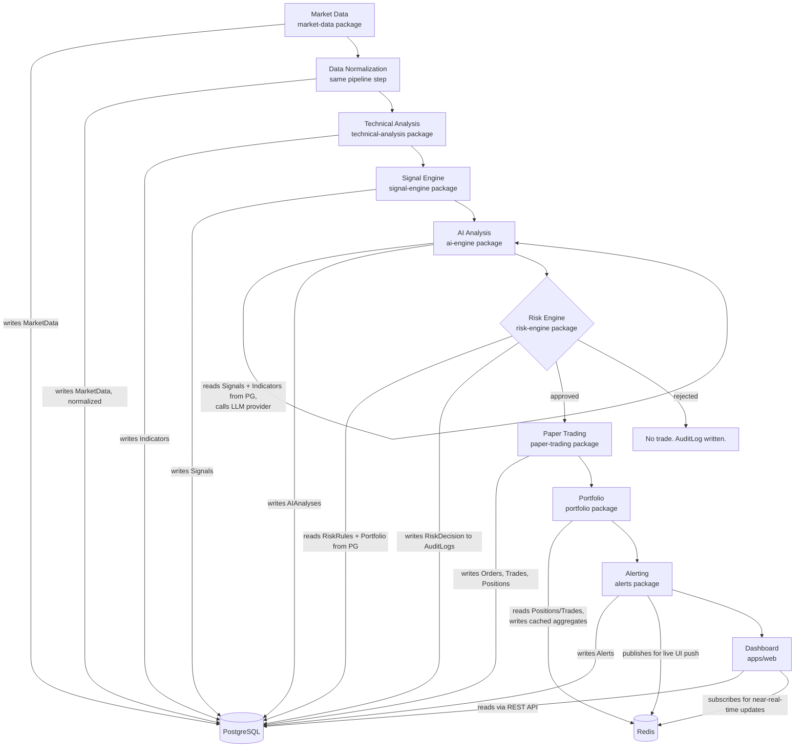
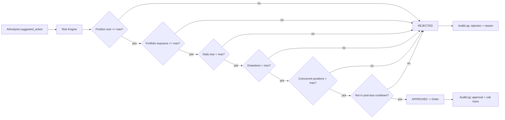
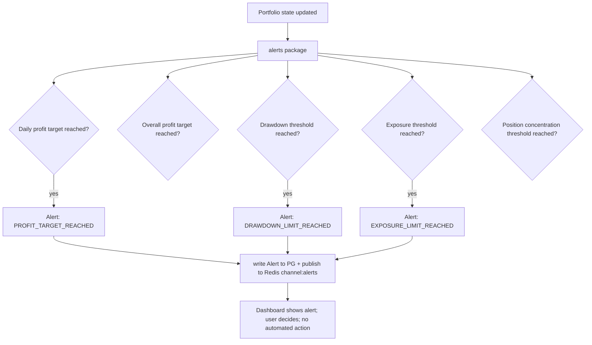

# MarketPilot AI — Data Flow

Companion to [architecture.md](architecture.md). This document traces where data lives and moves at each pipeline stage.

## 1. Pipeline overview



## 2. Where each store is used

### PostgreSQL — system of record

Every entity in [database.md](database.md) lives here and only here: `market_data`, `indicators`, `signals`, `ai_analyses`, `portfolios`, `positions`, `orders`, `trades`, `risk_rules`, `alerts`, `strategies`, `backtests`, `audit_logs`, plus `users`, `assets`, `watchlists`. If Postgres is lost, the system's state is lost — there is no other durable store. Backups and migrations (Alembic) are Postgres-only concerns.

### Redis — disposable cache and fan-out, never the only copy

| Use | Key shape | TTL | What happens if it's empty |
|---|---|---|---|
| Portfolio aggregate cache (value, P/L, exposure) | `portfolio:{portfolio_id}:summary` | 5-15s | Recomputed from Postgres on next read |
| Latest price cache (avoids re-querying `market_data` for every dashboard poll) | `price:{asset_id}:latest` | 5-10s | Read from Postgres instead |
| Pub/sub channel for near-real-time dashboard push (new signal, new alert, price tick) | `channel:signals`, `channel:alerts`, `channel:prices` | n/a (fire-and-forget) | Dashboard falls back to polling REST endpoints |
| Rate-limit counters (API, AI provider calls) | `ratelimit:{scope}:{key}` | window-based | Rate limiting fails open or closed per endpoint policy — see [security.md](security.md) |
| Session / short-lived auth tokens (once auth is implemented beyond MVP scaffolding) | `session:{token}` | session lifetime | User is required to re-authenticate |

Nothing in this table is a source of truth. A `redis-cli FLUSHALL` degrades performance and momentarily breaks live-push, never correctness.

## 3. AI analysis flow (detail)

```mermaid
sequenceDiagram
    participant SE as signal-engine
    participant AE as ai-engine
    participant LLM as Claude (AIProvider)
    participant DB as PostgreSQL

    SE->>DB: write Signal (deterministic)
    AE->>DB: read Signal + related Indicators
    AE->>LLM: structured prompt (symbol, indicators, signal, portfolio summary)
    LLM-->>AE: structured response (see ai-architecture.md schema)
    AE->>AE: validate response against AIAnalysis schema
    alt valid
        AE->>DB: write AIAnalysis (linked to Signal)
    else invalid / timeout / provider error
        AE->>DB: write AuditLog (ai_analysis_failed)
        Note over AE: no AIAnalysis written; pipeline continues without one
    end
```

Full schema and safety rationale: [ai-architecture.md](ai-architecture.md).

## 4. Signal generation flow (detail)

Pure and deterministic — no external calls:

```
Indicators (RSI, MACD, MA cross, volume ratio, ATR, VWAP delta)
    -> rule set (thresholds + combinations, versioned)
    -> Signal { asset_id, direction, strength, supporting_indicator_ids,
                contradicting_indicator_ids, generated_at }
```

Re-running the same rule set against the same `Indicators` row always produces the same `Signal`. Rule versions are recorded on the `Signal` row so historical signals remain reproducible even after the rule set changes.

## 5. Risk validation flow (detail)



Every check is a deterministic comparison against `risk_rules` values and current `portfolio`/`positions` state read from Postgres — no LLM involvement. Full rule definitions: [risk-engine.md](risk-engine.md).

## 6. Paper-trading flow (detail)

```
Approved order -> paper-trading.service.execute_order()
    -> simulate fill at current market price +/- configured slippage model
    -> apply fee schedule (configurable, defaults to a flat or percentage model)
    -> write Trade (fill price, quantity, fees, timestamp)
    -> update or create Position
    -> write AuditLog (trade_executed)
```

No real brokerage API is called anywhere in this path. See [ADR-007](decisions/ADR-007-paper-trading-first.md).

## 7. Alert flow (detail)



Full threshold design: [profit-protection.md](profit-protection.md). Alerts are always recommendations — the system never withdraws, closes a position, or otherwise acts on an alert without the user initiating the action.

## 8. Audit events

`audit` is the single writer of `audit_logs`. Every step in §1 that changes state calls `audit.service.record(actor, action, entity_type, entity_id, before, after, metadata)` in the same transaction as its own write, so an audit entry can never be silently skipped by a partial commit. Read access to `audit_logs` is exposed read-only; nothing ever updates or deletes an audit row.
