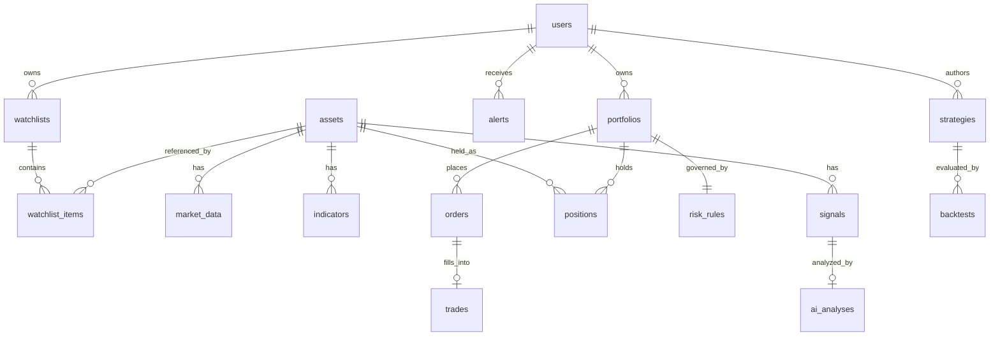

# MarketPilot AI — Database Architecture

PostgreSQL 16. Managed via Alembic migrations, one linear history across all packages' models (package boundaries are a Python/import concern, not a schema-per-package concern — the database is one coherent whole). No destructive raw SQL; no hard-coded credentials, connection info via environment variables only (see [security.md](security.md)).

## 1. Financial data integrity — read this before the schema

- **No floats for money, price, or quantity, anywhere** — not in the database, not in Python, not in JSON responses that a client might parse and re-sum. All monetary and quantity columns are `NUMERIC` (Postgres exact decimal), mapped to Python's `Decimal` in SQLAlchemy/Pydantic models, never `float`.
- **Price precision**: `NUMERIC(20,8)`. Eight fractional digits covers equities/ETFs/forex (2-6 places) and crypto (up to 8 places) with one column type across `assets` of every class, avoiding a precision special-case per asset class.
- **Quantity precision**: `NUMERIC(28,10)`. Ten fractional digits so fractional-share equities and fractional crypto quantities (e.g. `0.00000042` BTC) are representable exactly.
- **Fees**: stored as their own `NUMERIC(20,8)` column on `trades`, never netted into `fill_price` — the fill price is always the true execution price; fees are always visible and auditable separately.
- **P/L**: never stored as a single mutable running total that gets edited in place. Realized P/L is derived from closed `trades` (sum of `(exit - entry) * quantity - fees`, computed in Postgres or the `portfolio` service, both using `Decimal`/`NUMERIC` arithmetic); unrealized P/L is derived on read from open `positions` against the latest `market_data` price. `portfolios.cash` is the one balance that *is* stored and updated, and every update to it is paired with a `trades` row and an `audit_logs` row that justify the delta — it is never edited independently.
- **Timestamps**: `TIMESTAMPTZ`, always stored and compared in UTC. Every table that represents an event (`market_data`, `signals`, `ai_analyses`, `trades`, `alerts`, `audit_logs`) has an explicit event timestamp separate from row-creation bookkeeping where the two could differ (e.g. a backfilled `market_data` row).
- **Idempotency**: `orders.idempotency_key` is a unique, not-null column. The scheduler and any client-initiated order submission generate a deterministic key (e.g. `{signal_id}:{rule_version}` for system-generated orders, a client-supplied UUID for user-initiated ones) so a retried request or a re-run pipeline cycle cannot create a duplicate order/trade. A duplicate submission is rejected with the existing order's id, not silently re-executed.
- **Auditability**: every table that represents money or a decision (`orders`, `trades`, `risk_rules` changes, `positions` changes) has a corresponding `audit_logs` entry written in the same transaction as the change (see [security.md](security.md) and [architecture.md](architecture.md) §4/§8). `audit_logs` rows are never updated or deleted — enforced at the application layer now, and at the database role/grant level before production.

## 2. Entity-relationship overview

## 3. Table definitions

### `users`
| Column | Type | Notes |
|---|---|---|
| `id` | UUID PK | |
| `email` | TEXT UNIQUE NOT NULL | |
| `password_hash` | TEXT | nullable in MVP scaffolding until auth is fully wired — see [security.md](security.md) |
| `display_name` | TEXT | |
| `created_at`, `updated_at` | TIMESTAMPTZ NOT NULL | |

### `assets`
| Column | Type | Notes |
|---|---|---|
| `id` | UUID PK | |
| `symbol` | TEXT NOT NULL | e.g. `NVDA`, `BTC-USD`, `EUR/USD` |
| `asset_class` | TEXT NOT NULL | CHECK IN (`equity`,`etf`,`crypto`,`forex`) |
| `name` | TEXT | |
| `exchange` | TEXT | nullable (not meaningful for forex/crypto pairs) |
| `currency` | TEXT NOT NULL DEFAULT `'USD'` | |
| `is_active` | BOOLEAN NOT NULL DEFAULT `true` | soft-disable without deleting history |
| `created_at` | TIMESTAMPTZ NOT NULL | |
| Constraints | `UNIQUE(symbol, asset_class)` | |

### `watchlists` / `watchlist_items`
| Table | Column | Type | Notes |
|---|---|---|---|
| `watchlists` | `id` | UUID PK | |
| | `user_id` | FK → `users.id` NOT NULL | |
| | `name` | TEXT NOT NULL | |
| | `created_at`, `updated_at` | TIMESTAMPTZ | |
| `watchlist_items` | `id` | UUID PK | |
| | `watchlist_id` | FK → `watchlists.id` NOT NULL | |
| | `asset_id` | FK → `assets.id` NOT NULL | |
| | `added_at` | TIMESTAMPTZ NOT NULL | |
| | Constraints | `UNIQUE(watchlist_id, asset_id)` | |

### `market_data`
| Column | Type | Notes |
|---|---|---|
| `id` | BIGSERIAL PK | high-volume table; sequential integer PK, not UUID, for index density |
| `asset_id` | FK → `assets.id` NOT NULL | |
| `timeframe` | TEXT NOT NULL | e.g. `1m`, `5m`, `1d` |
| `ts` | TIMESTAMPTZ NOT NULL | bar timestamp (open time), UTC |
| `open`,`high`,`low`,`close` | NUMERIC(20,8) NOT NULL | |
| `volume` | NUMERIC(28,10) NOT NULL | |
| `source` | TEXT NOT NULL | provider id; MVP value is always `mock` — see [ai-architecture.md](ai-architecture.md) note on labeled mock data |
| Constraints | `UNIQUE(asset_id, timeframe, ts)` | prevents duplicate bars on re-ingestion |
| Indexes | `(asset_id, timeframe, ts DESC)` | primary query pattern: latest N bars for an asset/timeframe |

### `indicators`
| Column | Type | Notes |
|---|---|---|
| `id` | BIGSERIAL PK | |
| `asset_id` | FK → `assets.id` NOT NULL | |
| `timeframe` | TEXT NOT NULL | |
| `ts` | TIMESTAMPTZ NOT NULL | |
| `name` | TEXT NOT NULL | e.g. `RSI_14`, `MACD`, `ATR_14`, `SMA_50`, `VWAP_DELTA` |
| `value` | NUMERIC(20,8) NOT NULL | |
| `metadata` | JSONB | secondary fields for multi-value indicators (e.g. MACD signal/histogram) |
| Constraints | `UNIQUE(asset_id, timeframe, ts, name)` | |
| Indexes | `(asset_id, name, ts DESC)` | |

### `signals`
| Column | Type | Notes |
|---|---|---|
| `id` | UUID PK | |
| `asset_id` | FK → `assets.id` NOT NULL | |
| `direction` | TEXT NOT NULL | CHECK IN (`long`,`short`,`neutral`) |
| `strength` | NUMERIC(5,2) NOT NULL | 0-100, deterministic rule score |
| `rule_version` | TEXT NOT NULL | reproducibility — see §1 |
| `supporting_indicator_ids` | JSONB NOT NULL | array of `indicators.id` |
| `contradicting_indicator_ids` | JSONB NOT NULL | |
| `status` | TEXT NOT NULL DEFAULT `'active'` | CHECK IN (`active`,`superseded`,`expired`) |
| `generated_at` | TIMESTAMPTZ NOT NULL | |
| Indexes | `(asset_id, generated_at DESC)`, `(status)` | |

### `ai_analyses`
| Column | Type | Notes |
|---|---|---|
| `id` | UUID PK | |
| `signal_id` | FK → `signals.id` NOT NULL | |
| `asset_id` | FK → `assets.id` NOT NULL | denormalized for direct query without a join |
| `market_state`,`trend`,`momentum`,`volume_assessment` | TEXT NOT NULL | enumerations — see [ai-architecture.md](ai-architecture.md) schema |
| `supporting_indicators`,`conflicting_indicators` | JSONB NOT NULL | |
| `thesis` | TEXT NOT NULL | hedged natural-language rationale |
| `invalidation_conditions` | TEXT NOT NULL | |
| `risk_level` | TEXT NOT NULL | CHECK IN (`low`,`moderate`,`high`) |
| `confidence` | NUMERIC(5,2) NOT NULL | CHECK `BETWEEN 0 AND 100` |
| `suggested_action` | TEXT NOT NULL | CHECK IN (`long`,`short`,`hold`,`close`,`none`) |
| `entry_zone_low`,`entry_zone_high` | NUMERIC(20,8) | nullable when action is `hold`/`none` |
| `stop_loss` | NUMERIC(20,8) | nullable |
| `take_profit_low`,`take_profit_high` | NUMERIC(20,8) | nullable |
| `model_name`,`model_version`,`prompt_version` | TEXT NOT NULL | reproducibility/auditability of AI output |
| `generated_at` | TIMESTAMPTZ NOT NULL | |
| Indexes | `(asset_id, generated_at DESC)`, `(signal_id)` | |

### `portfolios`
| Column | Type | Notes |
|---|---|---|
| `id` | UUID PK | |
| `user_id` | FK → `users.id` NOT NULL | |
| `name` | TEXT NOT NULL | |
| `cash` | NUMERIC(20,8) NOT NULL | see §1 — the one directly-updated balance |
| `mode` | TEXT NOT NULL DEFAULT `'paper'` | CHECK IN (`paper`) in the MVP — reserved value, no other mode is enabled by application logic |
| `created_at`,`updated_at` | TIMESTAMPTZ | |

### `positions`
| Column | Type | Notes |
|---|---|---|
| `id` | UUID PK | |
| `portfolio_id` | FK → `portfolios.id` NOT NULL | |
| `asset_id` | FK → `assets.id` NOT NULL | |
| `side` | TEXT NOT NULL | CHECK IN (`long`,`short`) |
| `quantity` | NUMERIC(28,10) NOT NULL | |
| `avg_entry_price` | NUMERIC(20,8) NOT NULL | |
| `realized_pl` | NUMERIC(20,8) NOT NULL DEFAULT 0 | accumulated on partial closes |
| `status` | TEXT NOT NULL DEFAULT `'open'` | CHECK IN (`open`,`closed`) |
| `opened_at` | TIMESTAMPTZ NOT NULL | |
| `closed_at` | TIMESTAMPTZ | nullable |
| Constraints | `UNIQUE(portfolio_id, asset_id) WHERE status = 'open'` | one open position per asset per portfolio in the MVP — a documented simplification, not a schema limitation for the future |
| Indexes | `(portfolio_id, status)` | |

### `orders`
| Column | Type | Notes |
|---|---|---|
| `id` | UUID PK | |
| `portfolio_id` | FK → `portfolios.id` NOT NULL | |
| `asset_id` | FK → `assets.id` NOT NULL | |
| `side` | TEXT NOT NULL | CHECK IN (`buy`,`sell`) |
| `order_type` | TEXT NOT NULL DEFAULT `'market'` | CHECK IN (`market`,`limit`) |
| `quantity` | NUMERIC(28,10) NOT NULL | |
| `limit_price` | NUMERIC(20,8) | nullable, required when `order_type = 'limit'` |
| `idempotency_key` | TEXT NOT NULL UNIQUE | see §1 |
| `signal_id` | FK → `signals.id` | nullable — null for user-initiated orders not tied to a signal |
| `ai_analysis_id` | FK → `ai_analyses.id` | nullable |
| `risk_decision` | TEXT NOT NULL | CHECK IN (`approved`,`rejected`) |
| `risk_decision_reason` | TEXT NOT NULL | human-readable rule trace |
| `status` | TEXT NOT NULL DEFAULT `'pending'` | CHECK IN (`pending`,`filled`,`rejected`,`cancelled`) |
| `created_at`,`updated_at` | TIMESTAMPTZ | |

### `trades`
| Column | Type | Notes |
|---|---|---|
| `id` | UUID PK | |
| `order_id` | FK → `orders.id` NOT NULL UNIQUE | one fill per order in the MVP (no partial fills yet) |
| `portfolio_id` | FK → `portfolios.id` NOT NULL | denormalized for query convenience |
| `asset_id` | FK → `assets.id` NOT NULL | |
| `side` | TEXT NOT NULL | |
| `quantity` | NUMERIC(28,10) NOT NULL | |
| `fill_price` | NUMERIC(20,8) NOT NULL | true execution price, never fee-adjusted — see §1 |
| `fees` | NUMERIC(20,8) NOT NULL DEFAULT 0 | |
| `executed_at` | TIMESTAMPTZ NOT NULL | |
| Indexes | `(portfolio_id, executed_at DESC)` | |

### `risk_rules`
| Column | Type | Notes |
|---|---|---|
| `id` | UUID PK | |
| `portfolio_id` | FK → `portfolios.id` NOT NULL UNIQUE | one active rule set per portfolio in the MVP |
| `max_position_size_pct` | NUMERIC(5,2) NOT NULL | |
| `max_portfolio_exposure_pct` | NUMERIC(5,2) NOT NULL | |
| `max_daily_loss_pct` | NUMERIC(5,2) NOT NULL | |
| `max_drawdown_pct` | NUMERIC(5,2) NOT NULL | |
| `default_stop_loss_pct` | NUMERIC(5,2) NOT NULL | |
| `default_take_profit_pct` | NUMERIC(5,2) NOT NULL | |
| `max_concurrent_positions` | INTEGER NOT NULL | |
| `cooldown_after_loss_minutes` | INTEGER NOT NULL | |
| `updated_at` | TIMESTAMPTZ NOT NULL | |

Full rule semantics: [risk-engine.md](risk-engine.md).

### `alerts`
| Column | Type | Notes |
|---|---|---|
| `id` | UUID PK | |
| `user_id` | FK → `users.id` NOT NULL | |
| `portfolio_id` | FK → `portfolios.id` | nullable (some alerts, e.g. a signal alert, aren't portfolio-scoped) |
| `type` | TEXT NOT NULL | e.g. `PROFIT_TARGET_REACHED`, `DRAWDOWN_LIMIT_REACHED`, `EXPOSURE_LIMIT_REACHED`, `SIGNAL_GENERATED`, `INVALIDATION_APPROACHING` — full list in [profit-protection.md](profit-protection.md) |
| `severity` | TEXT NOT NULL | CHECK IN (`info`,`warning`,`critical`) |
| `message` | TEXT NOT NULL | |
| `metadata` | JSONB | structured detail (threshold, actual value, related entity ids) |
| `is_read` | BOOLEAN NOT NULL DEFAULT `false` | |
| `created_at` | TIMESTAMPTZ NOT NULL | |
| Indexes | `(user_id, created_at DESC)` | |

### `strategies`
| Column | Type | Notes |
|---|---|---|
| `id` | UUID PK | |
| `user_id` | FK → `users.id` NOT NULL | |
| `name` | TEXT NOT NULL | |
| `rule_config` | JSONB NOT NULL | parameterization of signal rules for backtesting |
| `created_at`,`updated_at` | TIMESTAMPTZ | |

### `backtests`
| Column | Type | Notes |
|---|---|---|
| `id` | UUID PK | |
| `strategy_id` | FK → `strategies.id` NOT NULL | |
| `asset_ids` | JSONB NOT NULL | array of `assets.id` |
| `date_from`,`date_to` | DATE NOT NULL | |
| `status` | TEXT NOT NULL DEFAULT `'pending'` | CHECK IN (`pending`,`running`,`completed`,`failed`) |
| `results` | JSONB | summary metrics once completed: total return, win rate, max drawdown, trade count, profit factor |
| `created_at`,`completed_at` | TIMESTAMPTZ | |

### `audit_logs`
| Column | Type | Notes |
|---|---|---|
| `id` | BIGSERIAL PK | append-only, high-volume |
| `actor` | TEXT NOT NULL | `system`, `user:{id}`, `ai-engine`, `risk-engine`, etc. |
| `action` | TEXT NOT NULL | e.g. `order_approved`, `order_rejected`, `trade_executed`, `risk_rules_updated`, `ai_analysis_failed` |
| `entity_type` | TEXT NOT NULL | e.g. `order`, `trade`, `risk_rules` |
| `entity_id` | TEXT NOT NULL | polymorphic reference, stored as text to stay entity-type-agnostic |
| `before` | JSONB | nullable — state prior to the change |
| `after` | JSONB | nullable — state after the change |
| `metadata` | JSONB | nullable — free-form context (e.g. rule trace, request id) |
| `created_at` | TIMESTAMPTZ NOT NULL DEFAULT `now()` | |
| Indexes | `(entity_type, entity_id)`, `(created_at DESC)` | |
| Constraints | no application code path performs `UPDATE`/`DELETE` on this table; enforced at the database role/grant level before production |

## 4. Migration policy

One Alembic history at `db/migrations/`, shared across all packages. Each package's `models.py` contributes to a single SQLAlchemy metadata object; Alembic autogenerate diffs against that combined metadata. Migrations are additive-first (new nullable columns, new tables) in normal development; destructive migrations (drop column, tighten constraint) require a written justification in the migration's docstring and are never auto-applied in CI without review.
