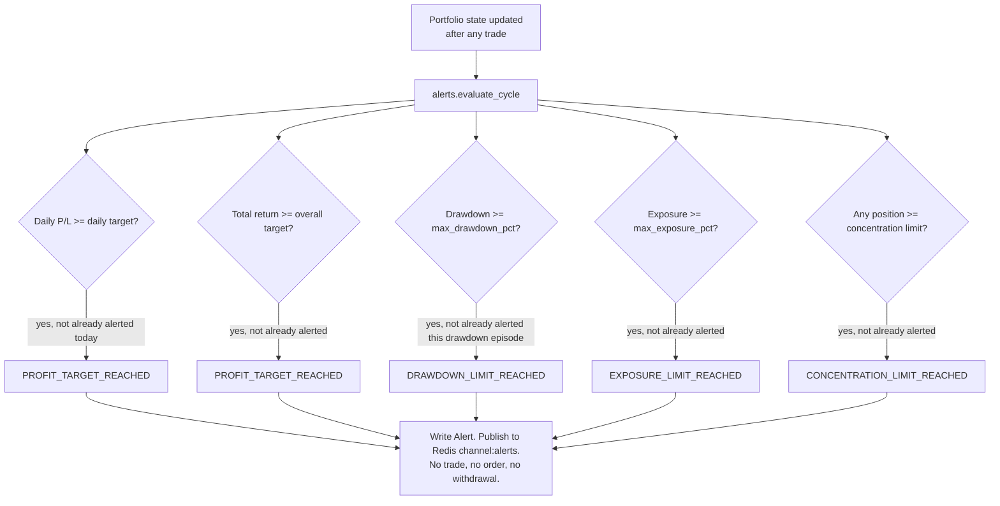

# MarketPilot AI — Profit Protection

Profit Protection is a monitoring system, not a withdrawal system. It watches portfolio thresholds and generates alerts. **It never moves money, closes a position, or takes any action on its own** — the user remains responsible for every real decision. This is a hard product boundary, not just an MVP limitation: see [ADR-007](decisions/ADR-007-paper-trading-first.md).

> **Status**: the `alerts` package this document describes is not built yet (later phase — see [architecture.md](architecture.md) §"Upcoming phases"). The *risk controls* it references are real as of Phase 6 ([risk-engine.md](risk-engine.md)), and as of Phase 7 the portfolio numbers underneath them (P/L, drawdown, exposure) are real trading data too, not a placeholder — see [paper-trading.md](paper-trading.md) §10/§13. This document is the design sketch for how a future `alerts` package will *observe* those same numbers without gating anything, once it exists.

## 1. Monitored thresholds

Configured per-portfolio (extends the Risk Engine's policy conceptually but would be evaluated by a future `alerts` package, not `RiskService` — profit protection *observes* the portfolio, it does not gate orders):

| Threshold | Source | Evaluated against |
|---|---|---|
| Daily profit target | user-configured % or absolute amount | Portfolio's daily realized + unrealized P/L |
| Overall profit target | user-configured % or absolute amount | Portfolio's total return since inception |
| Maximum drawdown | `risk_policies.max_drawdown_pct` (shared with the Risk Engine — one number, two consumers; see [risk-engine.md](risk-engine.md) §2/§5) | Current value vs. high-water mark |
| Portfolio exposure | `risk_policies.max_portfolio_exposure_pct` | Sum of open position value / portfolio value |
| Position concentration | user-configured % (default: same as `max_position_size_pct`) | Any single position's value / portfolio value |

The Risk Engine already computes drawdown and exposure on every risk evaluation (`GET /risk` exposes them live, backing the Risk Center's "Portfolio Risk" panel) — a future `alerts` package reads the same `risk_policies` row and the same portfolio snapshot, it doesn't recompute a separate copy of these numbers.

## 2. Alert types

| Type | Fires when | Severity |
|---|---|---|
| `PROFIT_TARGET_REACHED` | Daily or overall profit target threshold crossed | `info` |
| `DRAWDOWN_LIMIT_REACHED` | Drawdown threshold crossed | `warning` |
| `EXPOSURE_LIMIT_REACHED` | Portfolio exposure threshold crossed | `warning` |
| `CONCENTRATION_LIMIT_REACHED` | A single position's concentration threshold crossed | `warning` |
| `REVIEW_PROFIT_PROTECTION` | Any of the above fires while another of the above is already active and unread — a compound signal that several protective thresholds are live at once | `critical` |

Each alert's `message` states the threshold and the actual value (e.g. "Daily profit target reached — portfolio up 2.1% today, target was 2.0%"); `metadata` carries the structured values for the UI to render precisely rather than re-parsing the message string.

## 3. Evaluation flow

De-duplication: an alert type doesn't refire every cycle while its condition remains true (e.g. staying above the daily profit target doesn't spam an alert every pipeline run) — it refires only after the underlying condition resets (a new trading day for daily targets, drawdown recovering and re-breaching for drawdown, etc.), tracked by querying whether an unread or same-day alert of that type already exists rather than a separate state machine.

## 4. What happens after an alert fires

Nothing, automatically. The dashboard surfaces it (`AlertsTimeline`, and a badge/notification per [ui-design-system.md](ui-design-system.md)'s alert component). The user may choose to act — e.g. manually submit a closing order via `POST /trades`, which still passes through the risk engine like any other order — but MarketPilot never initiates that action itself, and there is no code path, present or planned in this architecture, that connects an alert to an automatic order or a real withdrawal. If real-money withdrawal is ever built, it is a distinct, explicitly-scoped future product decision, not an extension of this system.
