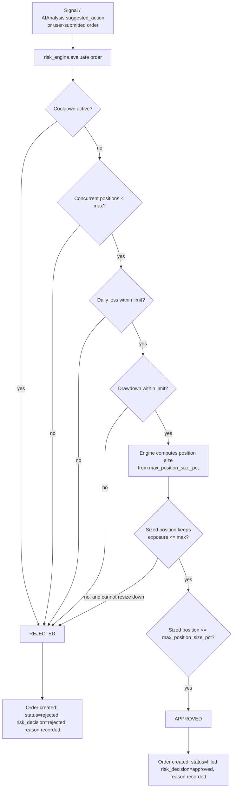

# MarketPilot AI — Risk Engine

The risk engine is `packages/risk_engine`. It contains no LLM calls, no network calls beyond reading Postgres, and no randomness. Given the same `risk_rules`, `portfolio`/`positions` state, and proposed order, it always returns the same decision. This determinism is the entire point: see [ADR-006](decisions/ADR-006-ai-risk-engine-separation.md) and [ai-architecture.md](ai-architecture.md) §4.

## 1. Rules

All configured per-portfolio in `risk_rules` ([database.md](database.md)):

| Rule | Field | Meaning |
|---|---|---|
| Maximum position size | `max_position_size_pct` | A single position's cost basis may not exceed this % of portfolio value at order time. |
| Maximum portfolio exposure | `max_portfolio_exposure_pct` | Sum of all open positions' current value may not exceed this % of portfolio value. |
| Maximum daily loss | `max_daily_loss_pct` | If realized + unrealized P/L for the current trading day is below `-max_daily_loss_pct`, no new positions may be opened for the rest of the day. |
| Maximum drawdown | `max_drawdown_pct` | If current portfolio value has fallen more than this % from its high-water mark, no new positions may be opened until drawdown recovers above the threshold. |
| Stop-loss | `default_stop_loss_pct` | Applied by the engine to every approved position it sizes — not read from the AI's suggestion (see [ai-architecture.md](ai-architecture.md) §4). |
| Take-profit | `default_take_profit_pct` | Same. |
| Maximum concurrent positions | `max_concurrent_positions` | Hard cap on open `positions` rows with `status = 'open'`. |
| Cooldown after losses | `cooldown_after_loss_minutes` | After a position closes at a loss, no new position may be opened in the same asset (MVP: any asset) until this many minutes have elapsed. |

## 2. Lifecycle

Every path — approved or rejected — produces an `Order` row and an `AuditLog` entry ([database.md](database.md), [security.md](security.md)). A rejection is not an error; it is the risk engine doing its job, and it is always visible to the user with its reason (see [api.md](api.md) `POST /trades`).

## 3. Sizing, not just gating

The risk engine does not merely approve or reject a size someone else proposed — for system-generated orders (from a signal/AI suggestion) it computes the size itself from `max_position_size_pct` and current portfolio value, then checks that size against exposure and concurrency limits. For user-submitted orders ([api.md](api.md) `POST /trades`), the user's requested quantity is checked as given — the engine does not silently resize a user's explicit request; it approves or rejects it against the same rules.

## 4. What the AI may influence, and what it may not

| | AI may influence | AI may not influence |
|---|---|---|
| Direction of a suggested trade | ✅ (`suggested_action`: long/short/hold/close/none) | |
| Position size | | ✅ — always engine-computed from `risk_rules` |
| Stop-loss / take-profit actually applied | | ✅ — always `default_stop_loss_pct`/`default_take_profit_pct` |
| Whether a rule is checked at all | | ✅ — all rules apply unconditionally |
| Risk rule values themselves | | ✅ — only `PUT /risk/rules` (user-authenticated, human) can change them |

## 5. Cooldown and drawdown state

Computed on read from `trades` and `positions` (not stored as separate mutable counters), so there is no risk of a cooldown/drawdown flag drifting out of sync with the trade history that should have set it:

- **Cooldown**: `now() - (last losing trade's executed_at) < cooldown_after_loss_minutes`.
- **Drawdown**: `(high_water_mark - current_portfolio_value) / high_water_mark`, where the high-water mark is the maximum `portfolio.value` observed for that portfolio (tracked via the `portfolio` package's performance history, not a separate risk-engine-owned field).
